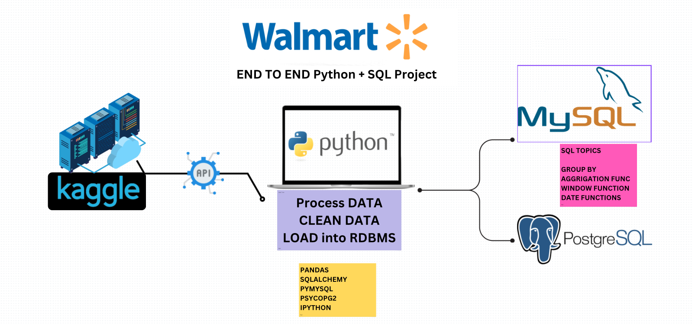

# 🛍 Walmart Sales Analysis | SQL + Python End-to-End Project

##  Overview



This project is a hands-on implementation of a complete data analysis workflow on Walmart sales data. Using a combination of SQL and Python, I extracted, cleaned, analyzed, and loaded data to solve real-world business problems. The project emphasizes practical skills in data manipulation, querying relational databases, and delivering actionable insights for decision-making.

---

##  Project Workflow

### 1. Environment Setup
- **Tools & Technologies**: Python, MySQL, VS Code
- **Objective**: Establish an organized workspace and prepare the local environment for efficient data processing and development.

### 2. Kaggle API Configuration
- **Setup**: Generated and downloaded a Kaggle API token from [Kaggle](https://www.kaggle.com/).
- **Integration Steps**:
  - Stored the `kaggle.json` credentials file securely under `.kaggle/`.
  - Used `kaggle datasets download -d <dataset-name>` to fetch the dataset programmatically.

### 3. Dataset Acquisition
- **Source**: Walmart sales data hosted on Kaggle.
- **Dataset URL**: [Walmart Sales Dataset](https://www.kaggle.com/datasets/lubainaraja/walmart-sales-dataset)

### 4. Library Installation & Data Loading
- **Required Libraries**:
  ```bash
  pip install pandas numpy sqlalchemy mysql-connector-python psycopg2
  ```
- **Data Import**: Loaded CSV files into Pandas DataFrames to perform initial inspection and preparation.

### 5. Initial Data Exploration
- **Purpose**: Understand column structure, detect anomalies, and identify transformations needed.
- **Methods Used**: `.info()`, `.head()`, `.describe()`, column type checking.

### 6. Data Cleaning Process
- Removed unnecessary duplicates to ensure accuracy.
- Treated missing or null entries through appropriate imputation or removal.
- Ensured consistent data types—converted strings to `datetime`, formatted currency fields, etc.
- Verified overall data integrity after transformations.

### 7. Feature Engineering
- Added a derived column `Total Amount` using:  
  `unit_price × quantity`
- These transformations improved downstream aggregation and analysis in SQL queries.

### 8. Database Integration
- **Connection Setup**: Used SQLAlchemy to connect Python to both MySQL and PostgreSQL.
- **Table Creation & Insertion**: Defined schema and loaded processed data into database tables.
- **Validation**: Ran sample queries to confirm data insertion and structure accuracy.

---

##  Business Questions Solved

I designed and executed SQL queries to answer the following business-critical questions:

- Q1: What are the most used payment methods and total quantities sold?
- Q2: Which product category has the highest average rating in each branch?
- Q3: What is the busiest day of the week for each branch based on number of transactions?
- Q4: What is the total quantity of items sold per payment method?
- Q5: What are the minimum, maximum, and average ratings of categories in each city?
- Q6: What is the total profit generated per category?


All queries were logged, and results interpreted to provide insights for operations and strategy.

---

##  Technologies Used

| Category      | Tools & Libraries                                  |
|---------------|----------------------------------------------------|
| Programming   | Python (Pandas, NumPy)                             |
| Databases     | MySQL                                              |
| Data Transfer | SQLAlchemy, MySQL Connector, psycopg2              |
| Other Tools   | Kaggle API, VS Code, Git, GitHub                   |

---

##  Project Structure

```
walmart-sales-analysis/
│
├── data              # Raw datasets
├── sql_queries       # SQL scripts for business questions
├── main.ipynb           # Python script to clean and load data
├── requirements.txt  # List of Python dependencies
└── README.md         # Project documentation
```

---

##  Key Insights

- Payment Trends: E-wallets were the most preferred payment method and contributed the highest item sales.
- Customer Ratings: Each branch had different top-rated categories; Fashion, Health and Beauty, and Electronics led in their respective branches.
- Weekly Sales Pattern: Friday was the busiest day across all branches, likely due to pre-weekend shopping habits.
- Profitability: Fashion Accessories and Home and Lifestyle were the most profitable categories.
- Sales Shifts: Evening shifts recorded the highest number of invoices, highlighting peak customer activity.
- Customer Behavior: Trends in ratings, payment preferences, and peak shopping hours.

---


##  Requirements

- Python 3.8 or above
- SQL Database (MySQL/PostgreSQL)
- Python Libraries:
  - `pandas`, `numpy`, `sqlalchemy`, `mysql-connector-python`, `psycopg2`
- Kaggle account and API token for dataset access

Install dependencies:
```bash
pip install -r requirements.txt
```

---

##  Getting Started

1. Clone the repository:
   ```bash
   git clone <repo-url>
   ```
2. Set up Kaggle API and download the dataset.
3. Run `main.py` to clean and load the data.
4. Explore SQL business queries in the `sql_queries` file.

---

##  License

Licensed under the MIT License.

---

##  Acknowledgments

- Data Source - Dataset provided by Kaggle.
- Inspiration - Inspired by real-world Walmart’s business case studies on sales and supply chain optimization.

---
